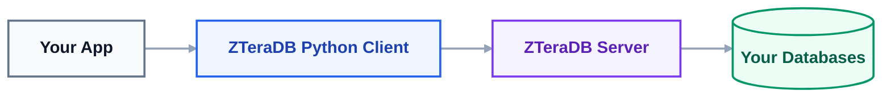

# 🐍 Python Client

Welcome to the official ZTeraDB Python Client documentation. This package implements a high-performance, ZQL-first database driver utilizing a raw TCP socket transport layer.

## 📘 What Is ZTeraDB?
ZTeraDB allows you to connect to your existing databases (PostgreSQL, MySQL, MSSQL, etc.) through a single, unified platform using One Unified Query Language (ZQL).

## Technical Overview
This package implements a performance-optimized, ZQL-first Python client utilizing an asynchronous, raw TCP socket transport layer.

To ensure low-overhead binary framing, the client communicates with the ZTeraDB server using 4-byte big-endian length-prefixed payloads containing structured JSON data. This underlying transport architecture eliminates HTTP overhead, offering high-throughput query execution directly from your Python runtime via asyncio.

## 🧠 Architecture Overview

You never connect to your backend databases directly. ZTeraDB handles all connections, cryptographic signing, proxy routing, and query execution securely behind the scenes.



---

## ⭐ Key Features

*   🚀 **Unified Query Language (ZQL):** Write once, run on any database.
*   🔌 **Easy Integration:** Seamlessly plugs into any Python application.
*   ⚙️ **Auto-Managed Connections:** Handles connection pooling and automatic retries.
*   🔐 **Secure Authentication:** Protected via client, access, and secret keys.
*   🎯 **Clean Query Builder:** Fluent interface for standard CRUD operations (`insert`, `select`, `update`, `delete`).
*   🔍 **Advanced Filtering:** Built-in support for complex logical and mathematical filters.
*   🧵 **Streamed Results:** Efficiently memory-manages large datasets using Python generators.
*   📦 **Modern Ecosystem:** Composer-ready and fully compatible with frameworks like Laravel, Symfony, and CodeIgniter.

---

## 🛠 Prerequisites & Requirements
| Requirement | Specification |
| :--- | :--- |
| **Python Version** | Python 3.8 or higher (Download from python.org) |
| **Dependencies** | Built-in asyncio support and standard socket modules |
| **Package Registry** | Available via [PyPI](https://pypi.org) |


---

## Installation
### Option 1: Via Pip (Recommended)
Run the following command in your terminal to install the ZTeraDB client:

```bash
# Using pip
pip install zteradb
```

### Option 2: From GitHub Repository
Alternatively, you can pull the package directly from GitHub using pip's VCS support:

```bash
pip install git+https://github.com/zteradb/zteradb-python.git
```

---

## 🧪 Running Tests

To verify that your installation is working correctly and the client can communicate with your environment, you can run the test suite.

### 1. Configure Environment Variables
Create a `.env` file in your root directory (or export them to your environment):

```bash
# Your ZTeraDB server host
ZTERADB_HOST=localhost

# Your ZTeraDB server port
ZTERADB_PORT=7777

# Get this from dashboard
ZTERADB_CLIENT_KEY=your_client_key_here
ZTERADB_ACCESS_KEY=your_access_key_here
ZTERADB_SECRET_KEY=your_secret_key_here
ZTERADB_DATABASE_ID=your_database_id_here
ZTERADB_ENV=dev
ZTERADB_RESPONSE_TYPE=json
ZTERADB_MIN_CONN=0
ZTERADB_MAX_CONN=1
USE_TLS=False
VERIFY_TLS_HOST=False
```

### 2. Run the Test Scripts
Execute the test suite using either the built-in Python unittest framework or pytest:
```bash
# Using standard Python unittest mapping
python -m unittest discover -s tests

pytest
```

If you prefer to run a single test module file explicitly:
```bash
python -m unittest tests/test_zteradb_query.py
```
---

## 🚀 60-Second Quick Start

```python
import asyncio
import logging
import os
import sys
from typing import Any

from zteradb import ZTeraDBConnectionAsync, ZTeraDBQuery
from zteradb.config.connection_pool import ConnectionPool
from zteradb.config.envs import ENVS
from zteradb.config.options import Options
from zteradb.config.response_data_types import ResponseDataTypes
from zteradb.config.zteradb_config import ZTeraDBConfig

# Configure logging for production visibility
logging.basicConfig(level=logging.INFO, format="%(asctime)s - %(levelname)s - %(message)s")
logger = logging.getLogger(__name__)

def get_required_env(key: str) -> str:
    """Ensures crucial configuration variables exist before proceeding."""
    value = os.getenv(key)
    if not value:
        logger.critical(f"Missing required environment variable: {key}")
        sys.exit(1)
    return value

async def main() -> None:
    # 1. Setup Configuration
    config = ZTeraDBConfig(
        client_key=get_required_env("ZTERADB_CLIENT_KEY"),
        access_key=get_required_env("ZTERADB_ACCESS_KEY"),
        secret_key=get_required_env("ZTERADB_SECRET_KEY"),
        database_id=get_required_env("ZTERADB_DATABASE_ID"),
        env=ENVS(os.getenv("ZTERADB_ENV", "dev")),
        response_data_type=ResponseDataTypes(os.getenv("ZTERADB_RESPONSE_TYPE", "json")),
        options=Options(
            connection_pool=ConnectionPool(
                min=int(os.getenv("ZTERADB_POOL_MIN", 1)),
                max=int(os.getenv("ZTERADB_POOL_MAX", 5))
            )
        ),
    )

    # 2. Initialize Connection
    host = get_required_env("ZTERADB_HOST")
    try:
        port = int(os.getenv("ZTERADB_PORT", "7777"))
    except ValueError:
        logger.error("Invalid ZTERADB_PORT format. Defaulting to 7777.")
        port = 7777

    db = ZTeraDBConnectionAsync(host, port, config)

    # 3. Robust Execution Framework
    try:
        # Build ZQL Query
        query = ZTeraDBQuery("user").select()
        
        # Execute and Process Results
        logger.info("Executing ZQL query...")
        result: Any = await db.run(query)
        print(result)

    except Exception as e:
        logger.error(f"Database operation failed: {e}", exc_info=True)
        
    finally:
        # 4. Guaranteed Cleanup
        # Ensures network sockets are closed even if the query errors out
        logger.info("Closing database connection...")
        await db.close()

if __name__ == "__main__":
    try:
        asyncio.run(main())
    except KeyboardInterrupt:
        logger.info("Application interrupted by user.")
```

---

## 🗂 Documentation Sections

Explore the rest of our guides to unlock the full potential of ZTeraDB:

*   🔐 [Configuration](./docs/config) — Learn all available configuration options.
*   🔌 [Connection](./docs/zteradb-connection) — Deep dive into socket connections and lifecycle management.
*   🔍 [Query Builder](./docs/zteradb-query) — Master building fluent ZQL queries.
*   🎛️ [Filter Conditions](./docs/filter-condition) — Apply advanced math and logical filters to your data.
*   🍳[Examples](./docs/query-examples) — Copy-pasteable snippets for common use cases.
*   🛠 [Troubleshooting Guide](./docs/troubleshooting) — How to resolve common connection or runtime errors.
*   🚀 [Quickstart Guide](./docs/quickstart) — A streamlined, 5-minute setup guide.
*   🥇 [Licence](./LICENCE) — Open-source licence terms.

---
