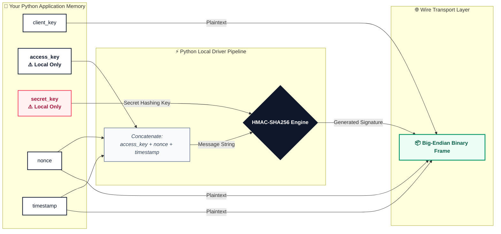
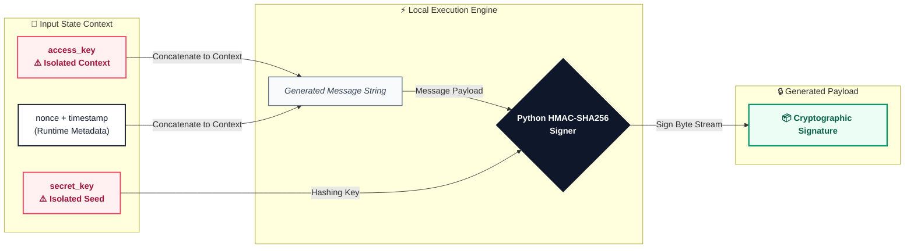

# 🔐 Configuration

This guide explains how to properly structure authentication parameters, cryptographic signing credentials, and operational pooling layers using the type-safe `ZTeraDBConfig` engine interface.

---

## 🛡️ The Three-Key Authentication Protocol

To protect high-throughput binary frames passing over low-overhead socket connections, ZTeraDB utilizes a decoupled signature verification matrix that inherently prevents network replay attacks.



---

## 🔒 Cryptographic Replay-Protection Pipeline

Your `accessKey` and `secret_key` is never exposed to the network. Instead, every time a query is evaluated through the connection layer, the driver automatically handles a local **HMAC-SHA256 signature sequence**:



1. **Message Synthesis:** The driver links your readable `access_key`, a cryptographically secure random `nonce` (number used once), and a current Unix `timestamp`.
2. **Signature Calculation:** The local runtime hashes that message using your hidden `secret_key` as the HMAC cryptographic key.
3. **Payload Packaging:** The calculated signature, nonce, and timestamp are packed directly into the binary frame header. The server replicates this exact math using its vault copy of your secret key to guarantee the payload has not been modified or replayed.

    > ⚠️ **System Time Dependency:** Because signatures use timestamps, your application server's clock must be highly accurate. If your clock drifts by more than 5 minutes, the server will automatically reject transactions.

---

## 🧩 Complete Structure Overview
Here is the entire configuration matrix with its nested schemas:

```python
config = ZTeraDBConfig(
    client_key="string",
    access_key="string",
    secret_key="string",
    database_id="string",
    env=ENVS.DEV, # Class constant required
    response_data_type="json",
    use_tls=True | False,
    verify_tls_host=True | False,
    options=Options(
        connection_pool=ConnectionPool(
            min=0,
            max=0
        )
    )
)
```

---

## ⚙️ Advanced Properties Reference

### 1. Authentication & Core Identity

| Parameter | Type | Exposure | Operational Responsibility |
| :--- | :--- | :--- | :--- |
| `client_key` | `str` | Public | **Required.** Your unique ZTeraDB user account identity string. Found in your **Dashboard -> User Profile → Security Credentials**. |
| `access_key` | `str` | Private | **Required. Never transmit over the wire.** A token used locally by the Python runtime, combined with a nonce and timestamp, to generate or verify an HMAC payload |
| `secret_key` | `str` | **Secret** | **Required. Never transmit over the wire.** Used locally by the Python runtime to execute an HMAC integrity checksum on raw payloads. |
| `database_id` | `str` | Private | **Required.** The static unique string pointing to your isolated target database cluster instance. |

> 🔒 **Security Best Practice:** Never hardcode your `access_key` and `secret_key` into your codebase or commit configurations to version control. Always extract parameters dynamically at runtime using secure environment variables.

---

### 2. Environment & Serialization

* **`env`** *(Allowed Values: `ENVS::DEV` \| `ENVS::STAGING` \| `ENVS::QA` \| `ENVS::PROD`)*  
  Routes client pool sockets to the correct internal server infrastructure stage.
* **`response_data_type`** *(Allowed Values: `ResponseDataTypes::json`)*  
  Instructs the underlying framing transport how to deserialize the un-prefixed buffer payloads. Currently defaults exclusively to JSON parsing.


---

### 3. Transport Layer Security (TLS)

| Parameter | Type | Default | Description |
| :--- | :--- | :--- | :--- |
| `use_tls` | `bool` | `False` | Upgrades the raw TCP transport stream to an encrypted TLS socket connection. |
| `verify_tls_host` | `bool` | `True` | When TLS is enabled, this checks that the server's certificate matches the target hostname. Toggle to `False` **only** during development if testing with self-signed local certificates. |

---

### 4. Performance Tuning (options.connection_pool)
For traffic-heavy apps, pass an Options object holding a ConnectionPool config to configure socket reuse rules.

```python
from zteradb.config.options import Options
from zteradb.config.connection_pool import ConnectionPool

options=Options(
    connection_pool=ConnectionPool(min=2, max=10)
)
```

| Field | Meaning |
|-------|---------|
| `min` | Minimum persistent connections ZTeraDB keeps open |
| `max` | Maximum number of allowed connections |

* Note: If this configuration is omitted, ZTeraDB automatically provisions and scales connections dynamically based on traffic spikes.

---

## 🧪 Comprehensive Implementation Example

```python
import os
from zteradb.config.zteradb_config import ZTeraDBConfig
from zteradb.config.options import Options
from zteradb.config.connection_pool import ConnectionPool
from zteradb.config.response_data_types import ResponseDataTypes
from zteradb.config.envs import ENVS

config = ZTeraDBConfig(
    # Safely injected secrets via environment variables
    client_key=os.environ.get('ZTERADB_CLIENT_KEY'),
    access_key=os.environ.get('ZTERADB_ACCESS_KEY'),
    secret_key=os.environ.get('ZTERADB_SECRET_KEY'),
    database_id=os.environ.get('ZTERADB_DATABASE_ID'),
    
    # Core Engine Handlers
    env=ENVS.PROD,
    response_data_type=ResponseDataTypes.JSON,
    
    # Socket Encryption Layers
    use_tls=True,
    verify_tls_host=True,
    
    # Custom Resource Allocation Limits
    options=Options(
        connection_pool=ConnectionPool(min=5, max=25)
    ),
)
```

---

## ⚠️ Common Anti-Patterns to Avoid

* ❌ **Hardcoding and Committing Secrets:** Writing sensitive credentials directly into script configurations or accidentally pushing them to version control repositories (e.g., GitHub).
  * **Fix:** Inject keys dynamically via system environment variables. Retrieve them securely at runtime using the `os.environ.get()` function to keep credentials decoupled from your codebase.

* ❌ **Passing Arbitrary or Raw Environment Strings:** Typing raw, un-validated string words (like `"production"`, `"local"`, or `"testing"`) directly into the configuration block.
  * **Fix:** Exclusively supply one of the whitelisted deployment targets: `"DEV"`, `"STAGING"`, `"QA"`, or `"PROD"`. For maximum type-safety and code completion, utilize the standard class constant pointers like ENVS.PROD.

* ❌ **Running Plaintext Connections in Production Environments:** Omitting the transport security flag or allowing it to fallback to False in live enterprise pipelines.
  * **Fix:** Explicitly toggle use_tls=True inside your production configuration parameter matrix to upgrade the transport stream to an encrypted socket connection and satisfy regulatory compliance constraints.

* ❌ **Improper Connection Pool Boundaries:** Supplying invalid numeric relationships for resource allocation, such as setting the minimum connection threshold higher than the maximum limit (`min` > `max`).
  * **Fix:** Ensure logical boundary constraints are met (e.g., `min=5`, `max=25`). The validation layers inspect both parameters and will trigger a structural configuration exception if the pooling boundaries cross.

---

### 🎉 Next Step
Your connection configurations are successfully structured. Proceed to link up the physical driver channel:  
👉 **[ZTeraDB Connection Guide](./zteradb-connection.md)**
