# 🔌 Connection

This guide explains how to establish, manage, and close connections to the ZTeraDB Server using the core `ZTeraDBConnectionAsync` client engine.

---

## 🔌 What is ZTeraDBConnectionAsync?
The `ZTeraDBConnectionAsync` class serves as the primary asynchronous network broker for your application. It abstracts low-level non-blocking socket management and handles:

* 🔐 **Secure Handshakes:** Opens and manages non-blocking TCP/TLS streams directly to the server using `asyncio`.
* 🎫 **Session Auth:** Handles initial token validations using your configuration keys.
* 🚀 **High-Throughput Streaming:** Executes ZQL payloads and delivers efficient asynchronous memory streams.
* 🔄 **Socket Reuse:** Integrates directly with client-side connection pooling layers to maximize database performance.

---

## 🧠 Architectural Overview

ZTeraDB decouples your application from the underlying target systems by acting as a single database proxy router:

```mermaid
graph LR
    %% Primary Core Nodes
    App["Your Python App"]
    Client["ZTeraDB Client"]
    Server["ZTeraDB Server"]
    DB["MySQL / PostgreSQL / MSSQL / ..."]

    %% Network / Protocol Intermediaries
    SOCKET["TCP Socket Layer<br />⚡ TLS Supported"]
    ROUTING["Multiplexed Routing<br />🔀 Load Balanced"]

    %% Pipeline Execution Flow
    App --> Client
    Client --> SOCKET --> Server
    Server --> ROUTING --> DB

    %% Component Styles (High Contrast, Bold Borders)
    style App fill:#ffffff,stroke:#0f172a,stroke-width:2.5px,color:#0f172a,font-weight:bold
    style Client fill:#eff6ff,stroke:#2563eb,stroke-width:2.5px,color:#1e40af,font-weight:bold
    style Server fill:#f5f3ff,stroke:#7c3aed,stroke-width:2.5px,color:#5b21b6,font-weight:bold
    style DB fill:#ecfdf5,stroke:#059669,stroke-width:2.5px,color:#065f46,font-weight:bold

    %% Protocol Styles (Sleek, De-emphasized Data-In-Transit Nodes)
    style SOCKET fill:#f8fafc,stroke:#e2e8f0,stroke-width:1px,color:#475569,font-style:italic
    style ROUTING fill:#f8fafc,stroke:#e2e8f0,stroke-width:1px,color:#475569,font-style:italic
```



---

## 📦 Initializing a Connection

The connection constructor accepts your target infrastructure endpoints along with your initialized configuration layout.

```python
from zteradb import ZTeraDBConnectionAsync

# Signature format: ZTeraDBConnectionAsync(host: str, port: int, config: ZTeraDBConfig)
db = ZTeraDBConnectionAsync(
    "db.zteradb.com", 
    7777, 
    config
)
```

---

## 🔑 Constructor Parameters

| Parameter | Type | Required | Description |
| :--- | :--- | :--- | :--- |
| `host` | `str` | **Yes** | The remote endpoint or network IP address allocated to your cluster runtime. *(e.g., `"db1.zteradb.com"`)* |
| `port` | `int` | **Yes** | The active TCP entry port assigned to your instance. Defaults universally to `7777`. |
| `config` | `ZTeraDBConfig` | **Yes** | An initialized, valid configuration matrix containing your authentication profile. |

---

## 🎛 Client Methods
1. `await db.run(query: ZTeraDBQuery)`
Submits an abstracted ZQL query framework directly to the cluster infrastructure socket. Because it executes over non-blocking sockets, this method must be awaited.

```python
query = ZTeraDBQuery("user").select()
result = await db.run(query)
```

* Memory Optimization: Depending on your configuration options, results can be processed as an asynchronous stream. Rows are parsed as they arrive over the wire rather than loading the entire payload block into memory at once. It is highly recommended to loop through streaming datasets via `async for`:

```python
async for row in result:
    print(row)
```

2. `await db.close() -> None`
Closes active streaming connections, flushes the internal connection pool, and frees up network socket descriptors on the host device.

```python
await db.close()
```

💡 Serverless Tip: Always explicitly invoke await db.close() at the conclusion of your script, especially inside ephemeral execution architectures (like AWS Lambda or Google Cloud Functions) to prevent connection leaks.

---

## 🧪 Complete Implementation Blueprint
```python
# app.py

import asyncio
import os
from dotenv import load_dotenv
from zteradb import ZTeraDBConnectionAsync, ZTeraDBQuery
from zteradb.config.zteradb_config import ZTeraDBConfig
from zteradb.config.options import Options
from zteradb.config.connection_pool import ConnectionPool
from zteradb.config.response_data_types import ResponseDataTypes
from zteradb.config.envs import ENVS

# Load local environment variables from .env file
load_dotenv()

async def main():
    # 1. Configure the connection pool scaling rules
    pool_config = ConnectionPool(
        min_size=int(os.getenv("MIN_CONNECTION", 1)),
        max_size=int(os.getenv("MAX_CONNECTION", 2))
    )
    
    # 2. Map structural options and properties
    options = Options(
        response_data_type=ResponseDataTypes(os.getenv("REQUEST_DATA_TYPE", "json")),
        connection_pool=pool_config
    )
    
    # 3. Structural configuration extraction
    config = ZTeraDBConfig(
        client_key=os.getenv("CLIENT_KEY"),
        access_key=os.getenv("ACCESS_KEY"),
        secret_key=os.getenv("SECRET_KEY"),
        database_id=os.getenv("DATABASE_ID"),
        env=ENVS(os.getenv("ZTERADB_ENV", "dev")),
        options=options
    )

    # 4. Establishing the network channel driver
    db = ZTeraDBConnectionAsync(
        os.getenv("ZTERADB_HOST", "db1.zteradb.com"),
        int(os.getenv("ZTERADB_PORT", "7777")),
        config
    )

    try:
        # 5. Execution Pipeline
        query = ZTeraDBQuery("user").select().limit(0, 10)
        result = await db.run(query)

        # Process the returned rows cleanly
        for row in result:
            print(row)
            
    except Exception as e:
        print(f"Database operation failed: {e}")
        
    finally:
        # 6. Resource Cleanup
        await db.close()

if __name__ == "__main__":
    asyncio.run(main())
```

---

## ⚠️ Troubleshooting Connection Failures
* ❌ **Socket Exception / Timeout Errors:** Usually points to incorrect network routing or network access controls blocking access.
    * Fix: Double-check your host endpoint address and make sure outbound connections on port `7777` are permitted by your local firewall or security group policies.

* ❌ **Authentication Rejections:** The client can reach the server but your security handshake fails.
    * Fix: Ensure all required keys (`client_key`, `access_key`, `secret_key`, and `database_id`) are mapped properly through your environment configuration setup.

* ❌ **Resource Leakage Warning:** Python warnings about unclosed event loops or high system socket metrics.
    * Fix: Wrap execution processes inside a structural `try...finally` block to make sure `await db.close()` runs regardless of processing runtime exceptions.

---

### 🎉 Next Step
Now that your connection pipeline is established, learn how to build complex data lookups:
👉 **[ZTeraDB Query Guide](./zteradb-query.md)**
